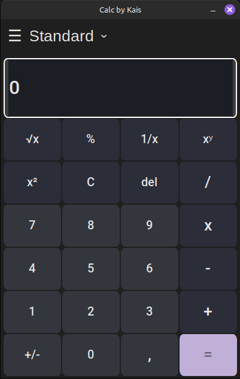

# 🧮 Calculator GUI

A simple and elegant **Python Calculator** built with [CustomTkinter](https://github.com/tomschimansky/customtkinter), providing a clean, modern look compared to the standard Tkinter widgets.  
This project was one of my first GUI applications in Python — showcasing basic arithmetic operations with a beautiful interface.

---

## 🎥 Demo Video

▶️ [Watch the demo](https://youtu.be/1wOT0yHGM0w)

---

## 🖼️ Screenshot



---

## 🚀 How to Run

Follow these steps to get the calculator running locally:

1. **Clone the repository:**
   ```bash
   git clone https://github.com/kais-grati/Calculator-GUI
   cd Calculator-GUI
   ```

2. **Create a virtual environment:**
   ```bash
   python -m venv venv
   ```

3. **Activate the virtual environment:**
   ```bash
   # On Windows
   venv\Scripts\activate

   # On macOS/Linux
   source venv/bin/activate
   ```

4. **Install dependencies:**
   ```bash
   pip install -r requirements.txt
   ```

5. **Run the calculator:**
   ```bash
   python calculator.py
   ```

---

## 🧰 Tech Stack

- **Python 3.12+**
- **[CustomTkinter](https://github.com/tomschimansky/customtkinter)** for modern GUI components

---

## 💡 Features

- 🧾 Basic operations (addition, subtraction, multiplication, division, sqrt, etc..) 
- 🎨 Modern, dark-themed GUI with CustomTkinter  
- 🪟 Resizable, responsive interface  
- ⚡ Lightweight and easy to use

---

## 🛠️ Future Enhancements

- Add keyboard input support  
- Include scientific functions (sin, cos, tan, etc.)  
- Add history or memory feature  

---

## 📄 License

This project is open-source under the **MIT License**.